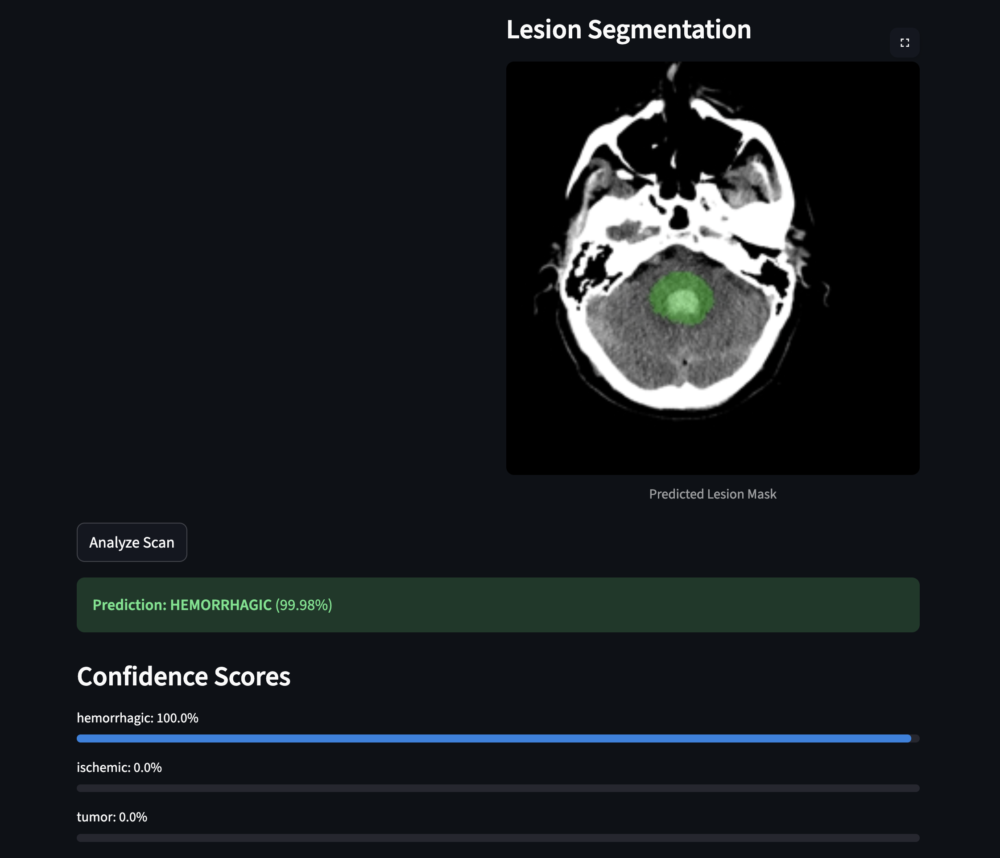

# NeuroSight-AI: Brain CT/MRI Diagnostic System




**NeuroSight-AI** is a comprehensive, AI-powered toolkit designed to assist in the diagnosis of brain pathologies from CT and MRI scans. By leveraging state-of-the-art deep learning architectures and explainable AI techniques, it provides clinicians and researchers with accurate classifications and interpretable visual insights.

---

## Features

- **Multi-Class Diagnosis**: Detects **Hemorrhagic Stroke**, **Ischemic Stroke**, and **Brain Tumors**.
- **Explainable AI (XAI)**: Integrated **Grad-CAM** visualizations to highlight suspicious regions.
- **Lesion Segmentation**: Pixel-level localization of anomalies using **U-Net**.
- **Concept Bottleneck Models**: Interpretable concept-based reasoning (e.g., "Hyperdensity", "Mass Effect").
- **User-Friendly Interface**: Interactive Web App built with Streamlit.


---

## Documentation

We have prepared comprehensive documentation to help you get started:

1.  **[Installation Guide](docs/01_installation.md)**
    *   Step-by-step setup for Mac (MPS), Linux (CUDA), and Windows.
2.  **[User Guide](docs/02_user_guide.md)**
    *   How to use the web interface and interpret results.
3.  **[Model Architecture](docs/03_model_architecture.md)**
    *   Technical deep-dive into ResNet50, CBM, and U-Net implementations.
4.  **[Development & Contributing](docs/04_development_guide.md)**
    *   Guide for retraining models and extending the codebase.

---

## ⚡️ Quick Start

### 1. Install Credentials
Clone the repo and install dependencies:

```bash
git clone https://github.com/Hamza-Elghonemy/NeuroSight-AI.git
cd NeuroSight-AI
pip install -r requirements.txt
```

### 2. Run the App
Launch the interface:

```bash
streamlit run app.py
```

Visit `http://localhost:8501` to start analyzing scans.

---

## 📂 Repository Structure

```
├── app.py                  # Main Application
├── docs/                   # Full Documentation
├── notebooks/              # Training & Research Notebooks
│   ├── 01_Data_Loader.ipynb
│   ├── 02_Classification_Model.ipynb
│   └── 05_Lesion_Segmentation.ipynb
├── src/                    # Core Inference & Training Logic
│   ├── inference.py        # Model Definitions & Utils
│   ├── train_segmentation.py # Segmentation Training Script
│   └── evaluate_segmentation.py # Model Evaluation Script
├── models/                 # Model Checkpoints (CNN, CBM, UNet)
└── requirements.txt        # Dependencies
```

## Disclaimer

This tool is intended for **research and educational purposes only**.
